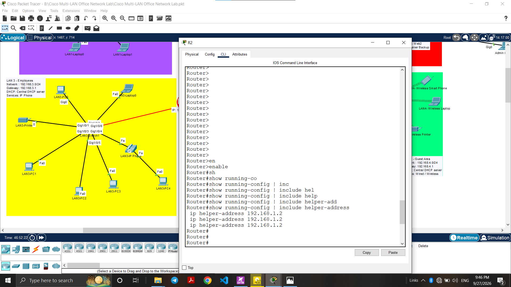

# Cisco Multi-LAN Office Network Lab

I built this lab in Cisco Packet Tracer to practice IPv4 networking 
and basic network services in a realistic office scenario.

The network is based on a small office with four LANs, two routers, 
several switches, servers, wireless devices, and structured cabling.

---

## Why I Built This

I wanted to practice the networking concepts I learned in Network+ 
and get comfortable with Packet Tracer before moving on to CCNA. 
This is my second networking project.

---

## Network Layout

The network is split into four separate LANs:

- **LAN 1** – Administration
- **LAN 2** – IT & Server Department
- **LAN 3** – Employees
- **LAN 4** – Guest Area

R1 connects LAN 1 and LAN 2.  
R2 connects LAN 3 and LAN 4.  
The two routers are connected to each other so the four LANs 
can communicate.

---

## Logical Topology

---

## Physical Workspace

---

## IP Addressing

| LAN | Network | Gateway |
|-----|---------|---------|
| LAN 1 | 192.168.1.0/24 | 192.168.1.1 |
| LAN 2 | 192.168.2.0/24 | 192.168.2.1 |
| LAN 3 | 192.168.3.0/24 | 192.168.3.1 |
| LAN 4 | 192.168.4.0/24 | 192.168.4.1 |

### DHCP Server

The DHCP server sits in LAN 1 with the IP address **192.168.1.2**.

LAN 2, LAN 3, and LAN 4 reach it through DHCP relay.

---

## Devices

### LAN 1 – Administration
- 2 PCs
- 2 Laptops
- DHCP Server
- Printer
- Cisco 2960 Switch

### LAN 2 – IT & Server Department
- 1 PC
- 1 Laptop
- 3 Web/DNS Servers
- 1 DNS Server
- 1 Backup Server
- Cisco 3560 Switch

### LAN 3 – Employees
- 5 PCs
- 1 Laptop
- Printer
- IP Phone
- Cisco 3560 Switch

### LAN 4 – Guest Area
- 6 Laptops
- 1 Wireless Laptop
- Smartphone
- Wireless Printer
- Access Point
- Cisco 2960 Switch

### Network / Wiring Closet
- 2 Routers
- 2 Cisco 2960 Switches
- 2 Cisco 3560 Switches
- Patch Panels
- Wall Mounts
- Structured Cabling

---

## Services

- Centralized DHCP
- DHCP Relay
- DNS
- Web Services
- Wireless Network Setup

The Backup Server is included as a server endpoint.  
A full backup system is not configured in this lab.

The IP Phone is connected to the network as an endpoint.  
Full VoIP infrastructure is not configured in this lab.

---

## Routing

Static routing is used to provide connectivity between the 
four LANs through R1 and R2.

---

## DHCP Verification

DHCP was tested on all four LANs.

---

## DHCP Relay Configuration

---

## Router-to-Router Connectivity

---

## Inter-LAN Connectivity

---

## Traceroute

---

## DNS Verification

Tested with `nslookup`.

---

## Web Server

Tested with both the IP address and the domain name.

---

## Router Configurations

- [R1 Configuration](configs/Configs-R1.txt)
- [R2 Configuration](configs/Configs-R2.txt)

---

## Project Files

- `packet-tracer/` – Packet Tracer project file
- `screenshots/` – All verification screenshots
- `configs/` – Router running configurations

---

## What I Learned

- Planning IPv4 addressing for multiple LANs
- How DHCP relay works when the server is on another subnet
- Testing a network properly before documenting it
- Structuring a project for GitHub

---

## Technologies

- Cisco Packet Tracer
- Cisco IOS CLI
- IPv4
- Static Routing
- DHCP
- DHCP Relay
- DNS
- HTTP
- Wireless Networking
- Structured Cabling

---

## Project Status

**Version:** v1.0  
**Status:** Completed
