# Cisco Multi-LAN Office Network Lab

A multi-LAN office network designed and implemented in Cisco Packet Tracer.

This project simulates a small office network with four IPv4 LANs, two routers, multiple switches, centralized DHCP, DHCP relay, DNS, web services, wireless access, and structured cabling.

---

## Network Overview

The network is divided into four separate LANs:

- **LAN 1 – Administration**
- **LAN 2 – IT & Server Department**
- **LAN 3 – Employees**
- **LAN 4 – Guest Area**

R1 connects LAN 1 and LAN 2.

R2 connects LAN 3 and LAN 4.

R1 and R2 are connected through a routed point-to-point link.

---

## Logical Topology

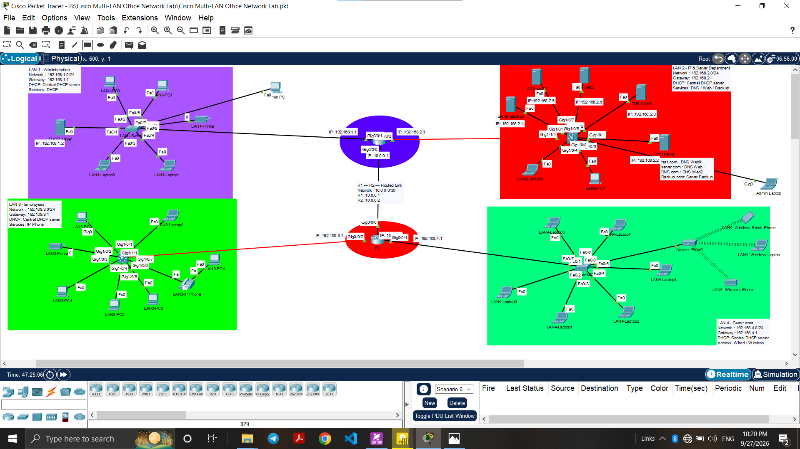

---

## Physical Workspace

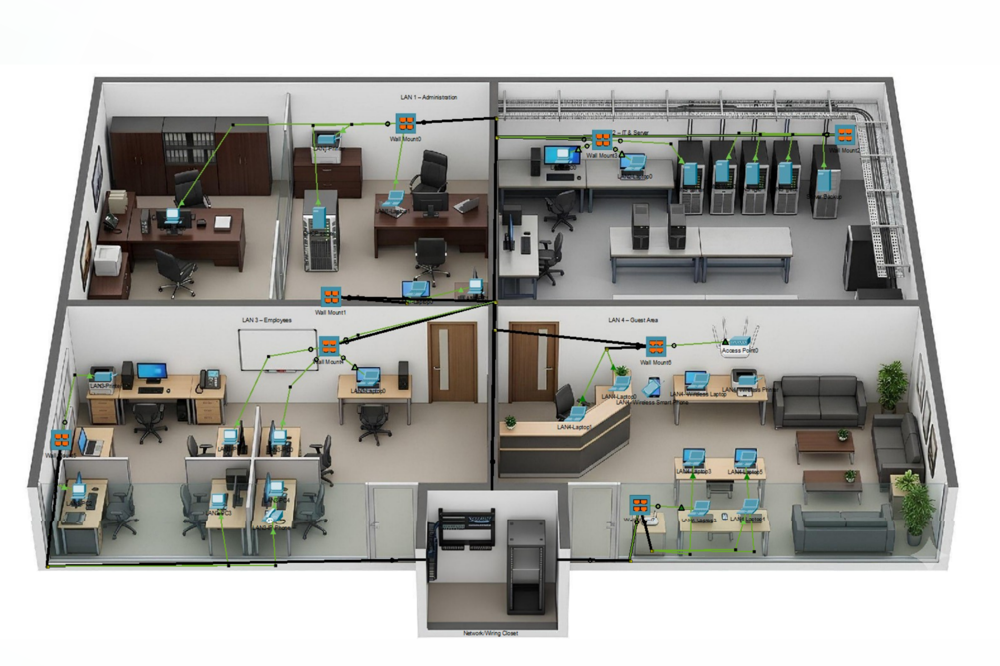

---

## IP Addressing

| LAN | Network | Gateway |
|---|---|---|
| LAN 1 | 192.168.1.0/24 | 192.168.1.1 |
| LAN 2 | 192.168.2.0/24 | 192.168.2.1 |
| LAN 3 | 192.168.3.0/24 | 192.168.3.1 |
| LAN 4 | 192.168.4.0/24 | 192.168.4.1 |

### DHCP Server

The network uses a centralized DHCP server located in LAN 1.

DHCP relay is configured on the appropriate router interfaces for remote LANs.

---

## Network Devices

### LAN 1 – Administration

- 2 PCs
- 2 Laptops
- DHCP Server
- Printer
- Cisco 2960 Switch

### LAN 2 – IT & Server Department

- 1 PC
- 1 Laptop
- 3 Web/DNS Servers
- 1 DNS Server
- 1 Backup Server
- Cisco 3560 Switch

### LAN 3 – Employees

- 5 PCs
- 1 Laptop
- Printer
- IP Phone
- Cisco 3560 Switch

### LAN 4 – Guest Area

- 6 Laptops
- 1 Wireless Laptop
- Smartphone
- Wireless Printer
- Access Point
- Cisco 2960 Switch

### Network / Wiring Closet

- 2 Routers
- 2 Cisco 2960 Switches
- 2 Cisco 3560 Switches
- Patch Panels
- Wall Mounts
- Structured Cabling

---

## Services

- Centralized DHCP
- DHCP Relay
- DNS
- Web Services
- Wireless Network Setup

A Backup Server is included in the network as a dedicated server endpoint.

The IP Phone is included as a network endpoint. Full VoIP infrastructure is not implemented in this lab.

---

## Routing

Static routing is used to provide connectivity between the four LANs through R1 and R2.

---

## DHCP Verification

DHCP was tested across all four LANs.

The remote LANs use DHCP relay to forward DHCP requests to the centralized DHCP server.

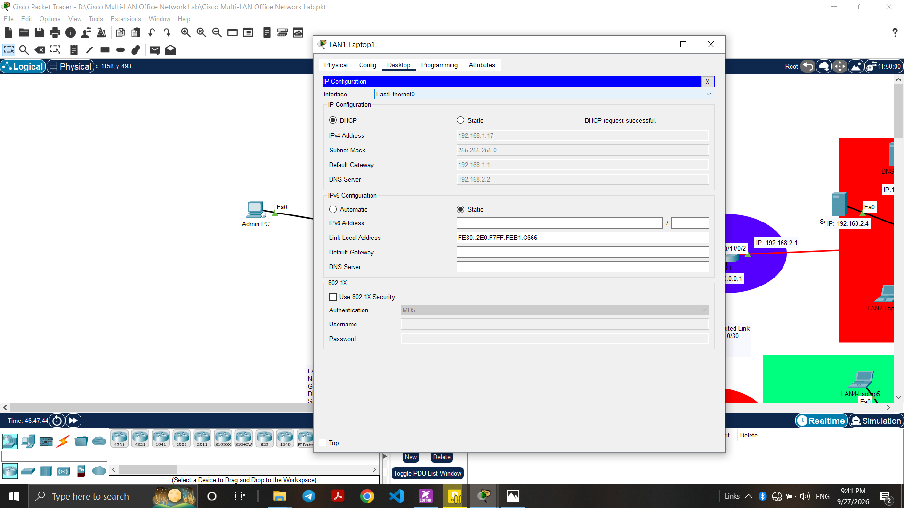

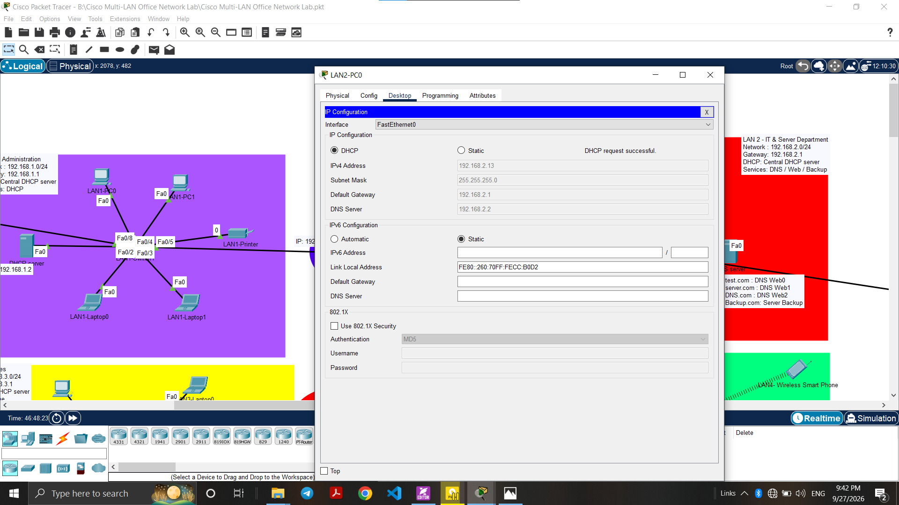

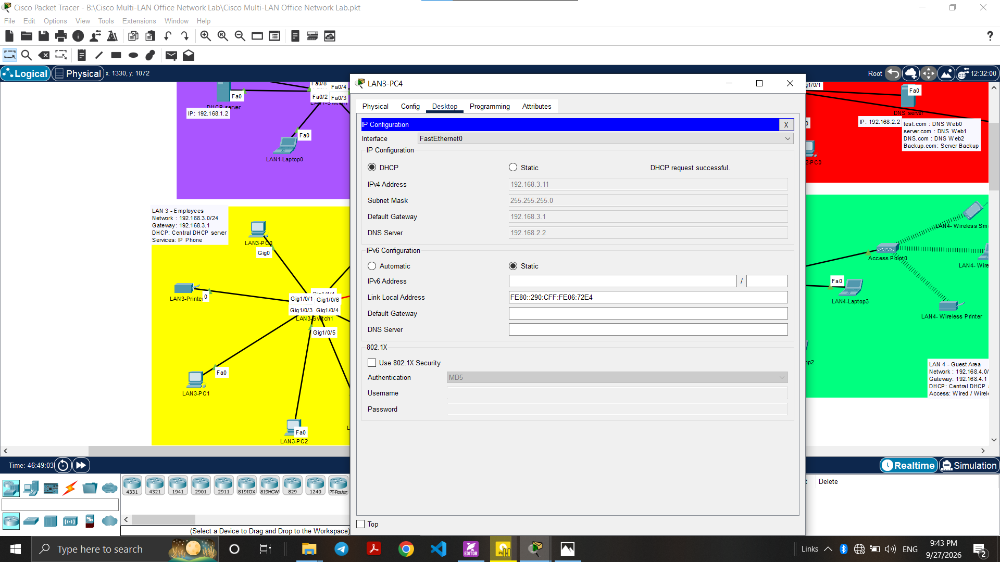

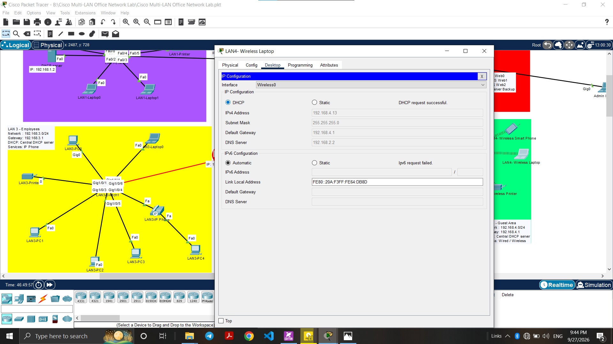

---

## Connectivity Verification

Router-to-router connectivity was tested successfully.

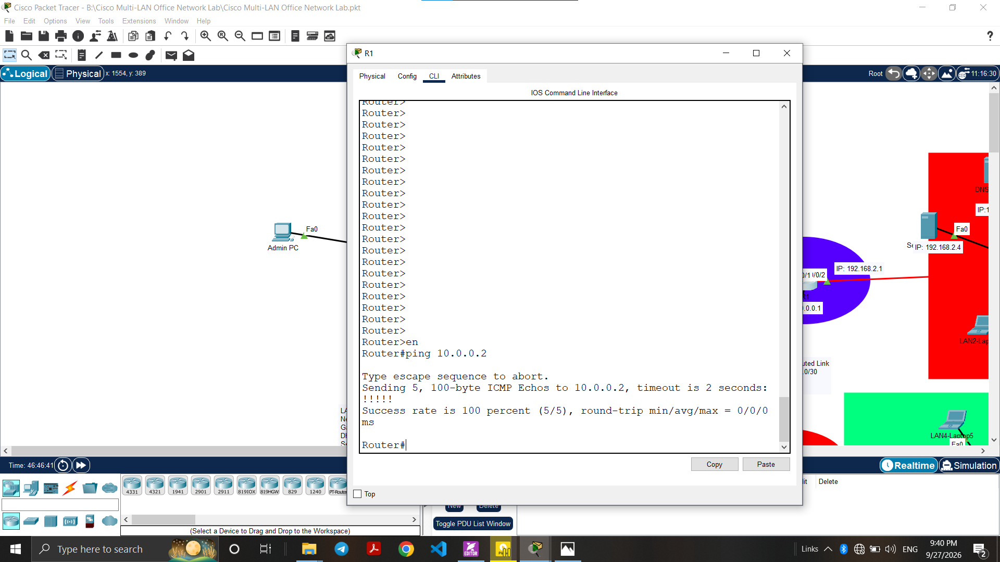

Inter-LAN connectivity was also tested between LAN 1 and LAN 4.

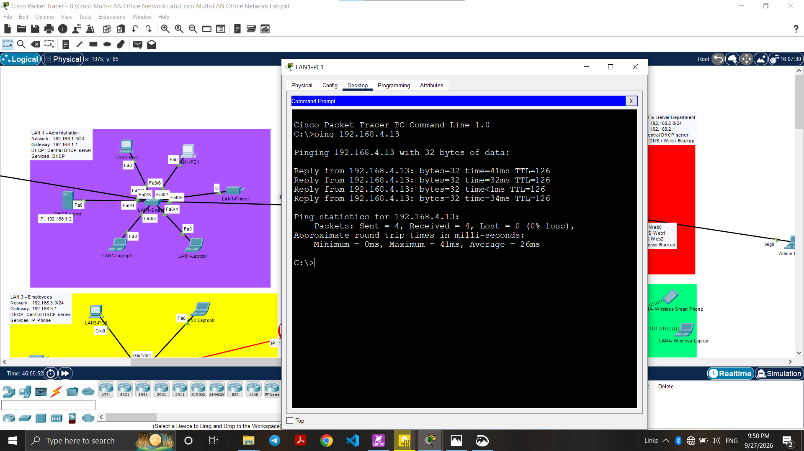

---

## Traceroute

Traceroute was used to verify the path between LAN 1 and LAN 4.

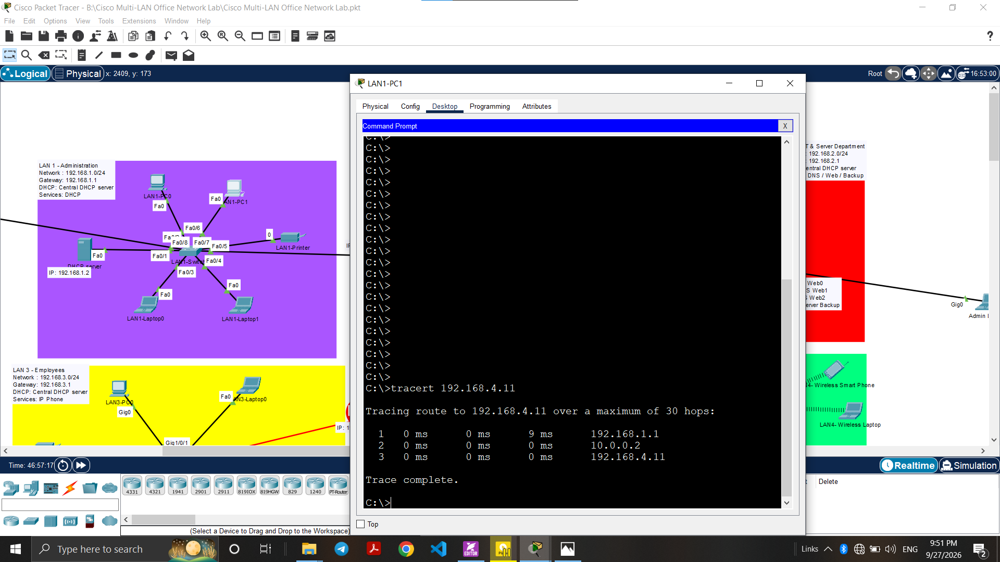

---

## DNS Verification

DNS name resolution was tested using `nslookup`.

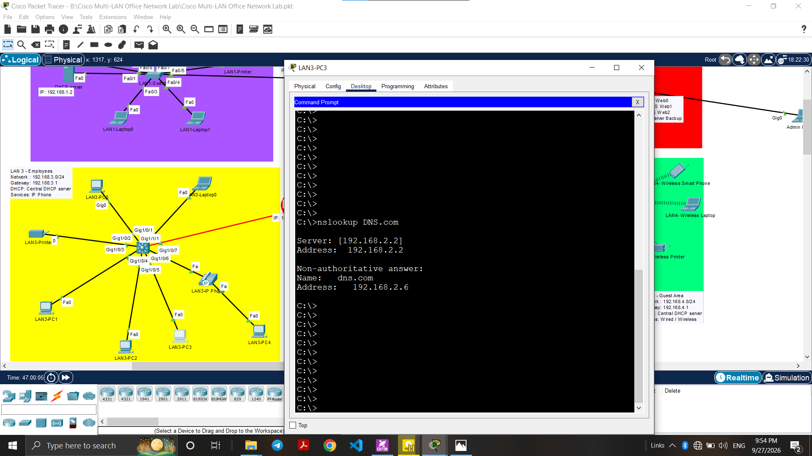

---

## Web Server Verification

Web access was tested using both the Web Server IP address and the configured domain name.

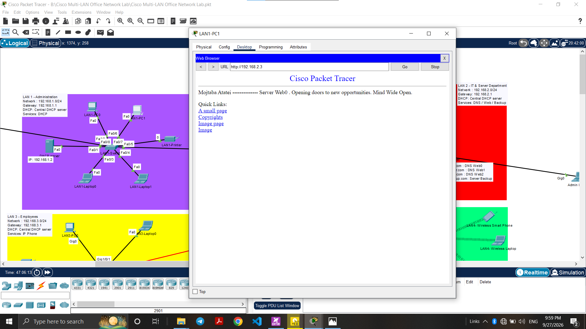

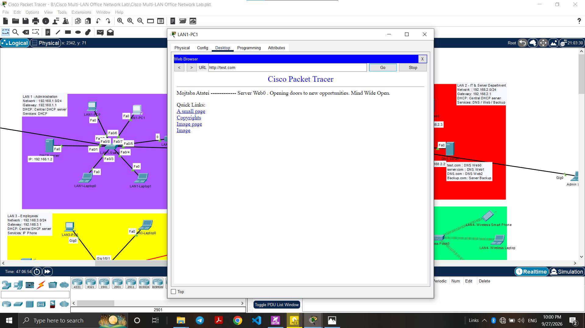

---

## Router Verification

The router configurations and verification outputs are available in the `configs` directory.

- [R1 Configuration](configs/Configs-R1.txt)
- [R2 Configuration](configs/Configs-R2.txt)

Verification includes:

- `show ip interface brief`
- `show ip route`
- DHCP relay configuration
- Router-to-router connectivity

---

## Project Files

The complete Packet Tracer project is available in the `packet-tracer` directory.

Additional verification screenshots are available in the `screenshots` directory.

---

## Technologies

- Cisco Packet Tracer
- Cisco IOS CLI
- IPv4
- Static Routing
- DHCP
- DHCP Relay
- DNS
- HTTP
- Wireless Networking
- Structured Cabling

---

## Project Status

**Version:** v1.0

**Status:** Completed
